# Predict Bitcoin Price

## Overview

This dataset contains historical Bitcoin (BTC) trading information for the BTC/USD currency pair. It includes various metrics related to BTC’s daily market activity, such as opening, high, low, and closing prices, trading volume, and timestamp in milliseconds. Additionally, the dataset includes calculated moving averages (5-day and 30-day) for both the closing price and trading volume. This detailed collection of BTC trading data provides insight into short-term and long-term market trends.

### **Dataset Columns:**

- **Date**: The date for each record.  
- **Product_Id**: The BTC/USD currency pair identifier.  
- **Timestamp_MS**: Unix timestamp in milliseconds, representing the precise time for each data entry.  
- **Open, High, Low, Close**: Daily price points of Bitcoin, giving a full view of each day's price range.  
- **Volume**: The trading volume in USD for each day, showing the level of market activity.  
- **Vol_Average5**: The 5-day moving average of the trading volume, which smooths short-term volume fluctuations.  
- **Moving_Average5 and Moving_Average30**: The 5-day and 30-day moving averages of the closing price, providing short-term and medium-term trend indicators.  

---

## Purpose of Selecting this Dataset

Bitcoin, being a highly volatile and globally traded asset, offers a rich case for analyzing price prediction and market behavior. By understanding and predicting price trends, stakeholders, including traders, investors, and financial analysts, can make informed decisions. The inclusion of technical indicators (moving averages) makes this dataset suitable for exploring time-series forecasting models and technical analysis methods.

---

## Plan for Working on the Dataset

1. **Exploratory Data Analysis (EDA):**
   - Conduct EDA to understand the dataset’s statistical properties, distribution, and relationships between variables.  
2. **Feature Engineering:**
   - Utilize existing columns to generate additional features such as percentage changes, volatility indicators, and other technical indicators like RSI (Relative Strength Index).  
3. **Time-Series Analysis:**
   - Analyze trends, seasonality, and cyclic behavior in BTC prices using timestamps and historical data.  
4. **Predictive Modeling:**
   - Build models such as ARIMA, LSTM, or XGBoost to forecast future BTC prices based on historical patterns.  
5. **Evaluation and Optimization:**
   - Evaluate model accuracy using metrics like RMSE (Root Mean Square Error) and optimize for improved performance.  
6. **Insights and Recommendations:**
   - Provide actionable insights for stakeholders looking to understand or invest in the BTC market.  

---

## Data Characteristics

The dataset is quantitative, consisting of numerical values such as prices, volume, and moving averages, which are essential for statistical and predictive modeling. It was downloaded from **Yahoo Finance**, ensuring credibility. The dataset contains 365 rows of daily trading data over one year, with a total file size of 41 KB. This scope provides a comprehensive view of Bitcoin's trading activity, capturing both short-term volatility and seasonal patterns.

---

## Table of Contents

1. [Overview](#overview)  
2. [Purpose of Selecting this Dataset](#purpose-of-selecting-this-dataset)  
3. [Plan for Working on the Dataset](#plan-for-working-on-the-dataset)  
4. [Data Characteristics](#data-characteristics)  
5. [Elaboration of SQL and Results](#elaboration-of-sql-and-results)  
6. [Summary](#summary)  

---

## Elaboration of SQL and Results

### Dataframe of BTC

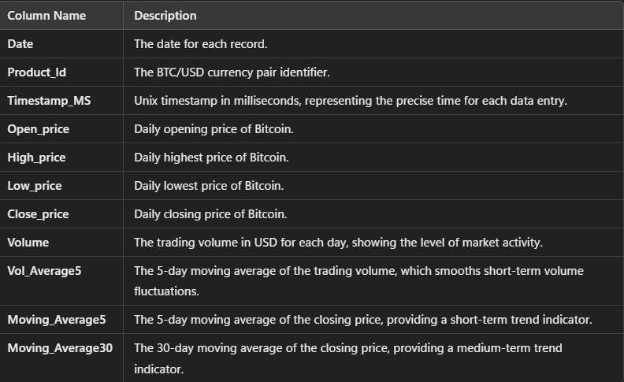

The dataset is quantitative in nature. It contains 365 rows of daily trading transaction. File size of 41 KB. This scope provides a comprehensive view of Bitcoin's trading activity across different time points. It good for detailed time-series forecasting and market trend analysis. It captures both short-term volatility and seasonal patterns.

---

&nbsp;
&nbsp;

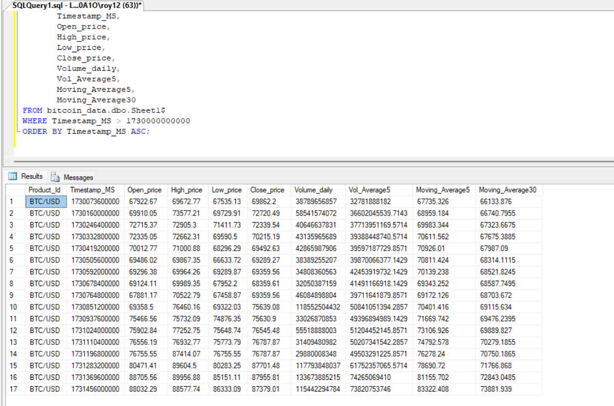
Elaboration SQL:  
The schema organizes data into columns like `Timestamp_MS`, `Open_price`, and `Close_price`, optimized for time-series analysis by making `Timestamp_MS` the primary key.
Explanation Results:  
It detects trends, anomalies, and supports time-specific analysis for informed trading and decision-making strategies.

&nbsp;
&nbsp;

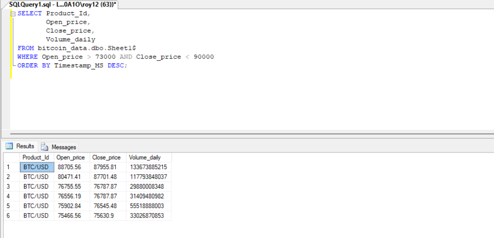
Elaboration SQL:  
Retrieves records where Open_price > 73000 and Close_price < 90000.  Sorted with Timestamp_MS descending.
Explain Results:  
Identifies days with specific price conditions. It really help spot trading .

&nbsp;
&nbsp;

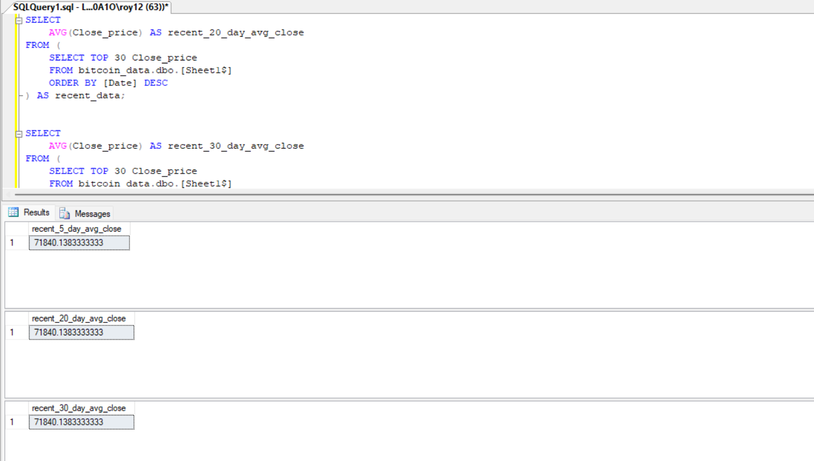
Elaboration:  
Calculates the average Close_price over 5, 20, and 30 days from the most recent data.
Results:  
Provides short-term and long-term price trends. Assist in trend analysis for trading strategies.

&nbsp;
&nbsp;

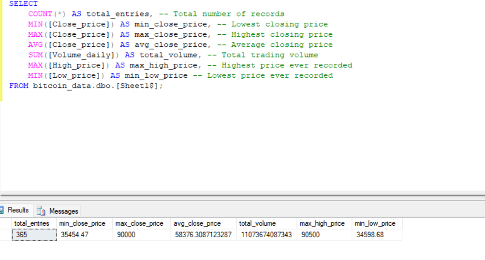
Elaboration SQL:  
Summary statistics such as total entries, min/max/average prices, and total trading volume.
Explain Results:  
Helps analyse overall market performance and key price.

&nbsp;
&nbsp;

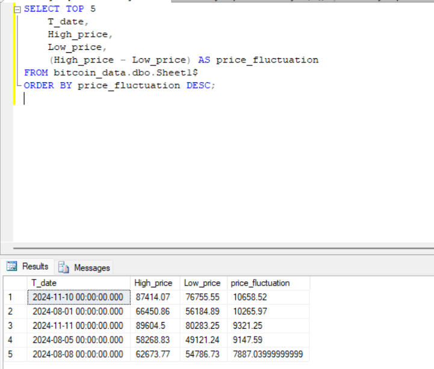
Elaboration SQL:  
Retrieves the top 5 days with the highest price fluctuations by calculate the difference between High_price and Low_price.
Explain Results:  
Find the most volatile trading days. To help assess market instability and potential opportunities.

&nbsp;
&nbsp;

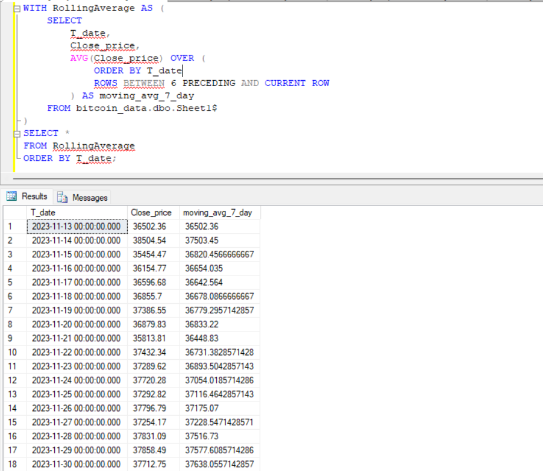
Elaboration SQL:  
To get 7-day moving average of Close_price using a window function.
Explain Results:  
Shows smoothed price trends, reduce daily volatility to help identify consistent patterns.

&nbsp;
&nbsp;

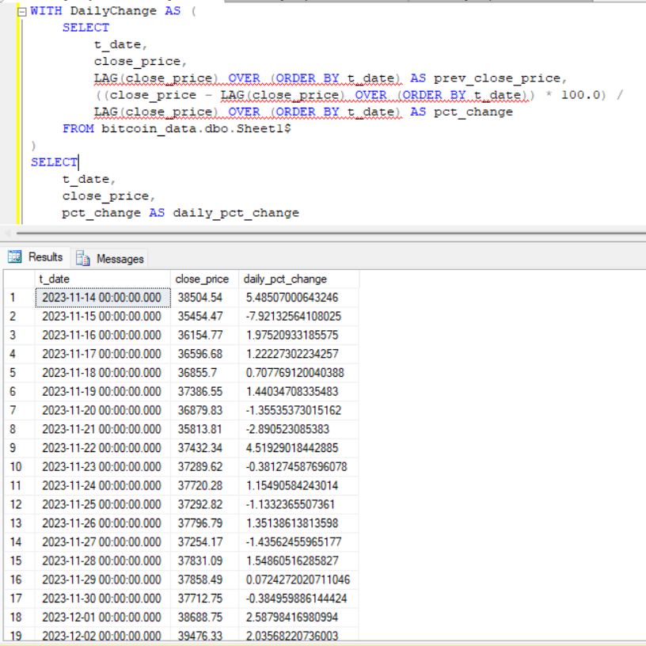
Elaboration SQL:  
Calculates daily percentage changes in closing price and compare each day with the previous day's close.
Explain Results:  
Help in get significant market fluctuations for investment decisions.

&nbsp;
&nbsp;

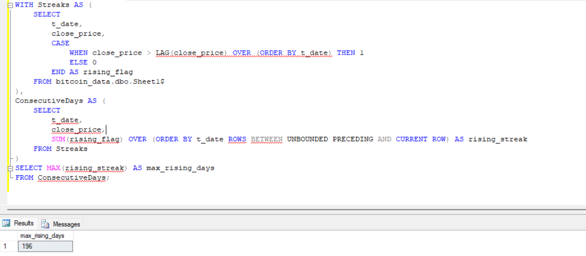
Elaboration SQL:  
Calculates the longest consecutive days with rising closing prices using window functions.
Explain Results:  
Identifies the maximum streak of price increases (197 days). Discover trend analysis.

&nbsp;
&nbsp;

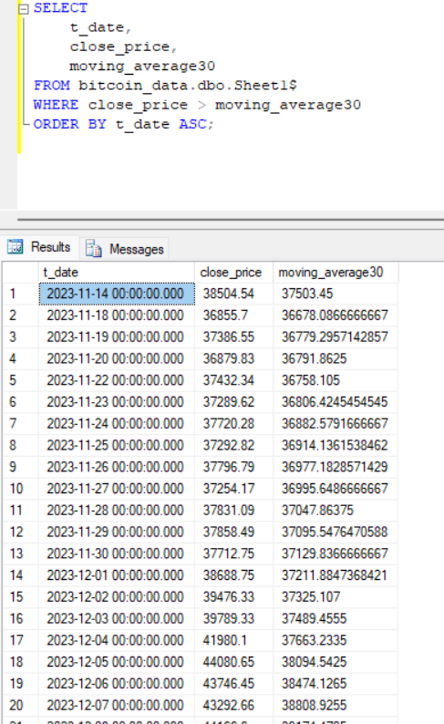
Elaboration SQL:  
Selects records where the closing price exceeds the 30-day moving average, sorted by date.
Explain Results:  
Highlights dates when prices outperformed the 30-day trend. It supports analysis of upward price momentum.

&nbsp;
&nbsp;

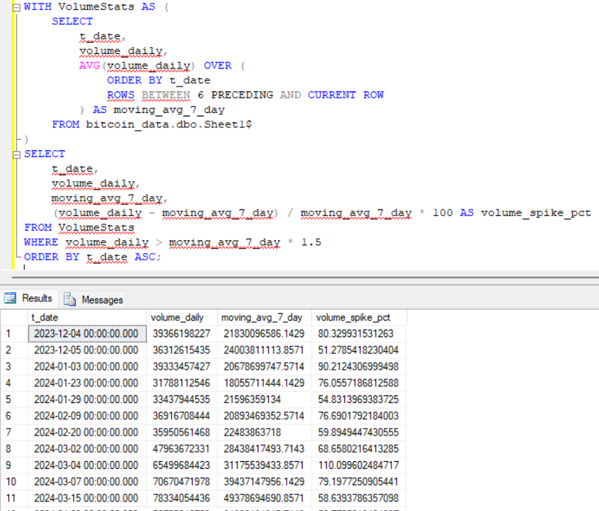
Elaboration SQL:  
Identifies days with trading volume spikes exceeding 1.5 times the 7-day moving average, show about percentage increase.
Explain Results:  
Highlights significant volume surges. Purpose for spotting unusual market activity.

&nbsp;
&nbsp;

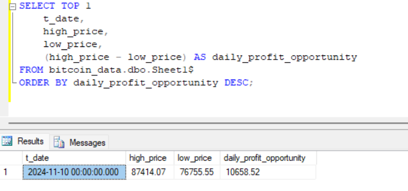
Elaboration SQL:  
Calculates the highest daily profit opportunity based on the difference between high and low prices.
Explain Results:  
Identifies the day with the maximum trading profit potential. It would help strategic decision-making for traders.

&nbsp;
&nbsp;

## Summary

Key Takeaways: SQL Mastery and Business Impact  

Data Management & Analysis: Mastered SQL skills to handle large datasets, enabling efficient extraction of insights like daily trends and trading volumes.  

Trend Detection: Improved ability to detect trends and anomalies for better market response.  

Workflow Efficiency: Automated repetitive tasks and corrected historical data, enhancing accuracy and efficiency.  

Strategic Decision-Making: Developed skills that enable more focus on strategic analysis, responding effectively to opportunities.  

This dataset captures comprehensive Bitcoin trading data with daily metrics and calculated indicators, providing valuable insights into price trends and market behavior over one year for predictive analysis.

&nbsp;
&nbsp;
